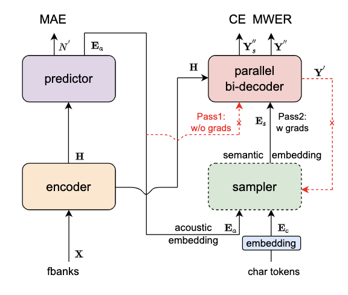

---
tasks:
- auto-speech-recognition
domain:
- audio
model-type:
- Non-autoregressive
frameworks:
- pytorch
backbone:
- transformer/conformer
metrics:
- CER
license: Apache License 2.0
language: 
- cn
tags:
- FunASR
- Paraformer
- Alibaba
- INTERSPEECH 2022
datasets:
  train:
  - 60,000 hour industrial Mandarin task
  test:
  - AISHELL-1 dev/test
  - AISHELL-2 dev_android/dev_ios/dev_mic/test_android/test_ios/test_mic
  - WentSpeech dev/test_meeting/test_net
  - SpeechIO TIOBE
  - 60,000 hour industrial Mandarin task
indexing:
   results:
   - task:
       name: Automatic Speech Recognition
     dataset:
       name: 60,000 hour industrial Mandarin task
       type: audio    # optional
       args: 16k sampling rate, 8404 characters  # optional
     metrics:
       - type: CER
         value: 8.53%  # float
         description: greedy search, withou lm, avg.
         args: default
       - type: RTF
         value: 0.0251  # float
         description: GPU inference on V100
         args: batch_size=1
widgets:
  - task: auto-speech-recognition
    inputs:
      - type: audio
        name: input
        title: 音频
    examples:
      - name: 1
        title: 示例1
        inputs:
          - name: input
            data: git://example/asr_example.wav
    inferencespec:
      cpu: 8 #CPU数量
      memory: 4096

finetune-support: True
---

# Paraformer-large模型介绍

[//]: # (Paraformer 模型是一种非自回归（Non-autoregressive）端到端语音识别模型。)

[//]: # (非自回归模型相比于自回归模型，可以对整条句子并行输出目标文字，具有更高的计算效率，尤其采用GPU解码。)

[//]: # (Paraformer模型相比于其他非自回归模型，不仅具有高效的解码效率，在模型参数可比的情况下，模型识别性能与SOTA的自回归模型相当。)

[//]: # (目前Paraformer在如下数据集进行了性能验证：[AISHELL-1]&#40;http://www.openslr.org/33/&#41;、[AISHELL-2]&#40;https://www.aishelltech.com/aishell_2&#41;、[WenetSpeech]&#40;http://www.openslr.org/121/&#41;、阿里内部工业大数据。)


## <strong>[ModelScope-FunASR](https://github.com/alibaba-damo-academy/FunASR)</strong>
<strong>[FunASR](https://github.com/alibaba-damo-academy/FunASR)</strong>希望在语音识别方面建立学术研究和工业应用之间的桥梁。通过支持在ModelScope上发布的工业级语音识别模型的训练和微调，研究人员和开发人员可以更方便地进行语音识别模型的研究和生产，并促进语音识别生态系统的发展。

[**最新动态**](https://github.com/alibaba-damo-academy/FunASR#whats-new) 
| [**环境安装**](https://github.com/alibaba-damo-academy/FunASR#installation)
| [**介绍文档**](https://alibaba-damo-academy.github.io/FunASR/en/index.html)
| [**中文教程**](https://github.com/alibaba-damo-academy/FunASR/wiki#funasr%E7%94%A8%E6%88%B7%E6%89%8B%E5%86%8C)
| [**服务部署**](https://github.com/alibaba-damo-academy/FunASR/tree/main/funasr/runtime)
| [**模型库**](https://github.com/alibaba-damo-academy/FunASR/blob/main/docs/model_zoo/modelscope_models.md)
| [**联系我们**](https://github.com/alibaba-damo-academy/FunASR#contact)


## 项目介绍

Paraformer是达摩院语音团队提出的一种高效的非自回归端到端语音识别框架。本项目为Paraformer中文通用语音识别模型，采用工业级数万小时的标注音频进行模型训练，保证了模型的通用识别效果。模型可以被应用于语音输入法、语音导航、智能会议纪要等场景。

<p align="center">



Paraformer模型结构如上图所示，由 Encoder、Predictor、Sampler、Decoder 与 Loss function 五部分组成。Encoder可以采用不同的网络结构，例如self-attention，conformer，SAN-M等。Predictor 为两层FFN，预测目标文字个数以及抽取目标文字对应的声学向量。Sampler 为无可学习参数模块，依据输入的声学向量和目标向量，生产含有语义的特征向量。Decoder 结构与自回归模型类似，为双向建模（自回归为单向建模）。Loss function 部分，除了交叉熵（CE）与 MWER 区分性优化目标，还包括了 Predictor 优化目标 MAE。


其核心点主要有：  
- Predictor 模块：基于 Continuous integrate-and-fire (CIF) 的 预测器 (Predictor) 来抽取目标文字对应的声学特征向量，可以更加准确的预测语音中目标文字个数。  
- Sampler：通过采样，将声学特征向量与目标文字向量变换成含有语义信息的特征向量，配合双向的 Decoder 来增强模型对于上下文的建模能力。  
- 基于负样本采样的 MWER 训练准则。  

更详细的细节见：
- 论文： [Paraformer: Fast and Accurate Parallel Transformer for Non-autoregressive End-to-End Speech Recognition](https://arxiv.org/abs/2206.08317)
- 论文解读：[Paraformer: 高识别率、高计算效率的单轮非自回归端到端语音识别模型](https://mp.weixin.qq.com/s/xQ87isj5_wxWiQs4qUXtVw)


## 如何使用与训练自己的模型

本项目提供的预训练模型是基于大数据训练的通用领域识别模型，开发者可以基于此模型进一步利用ModelScope的微调功能或者本项目对应的Github代码仓库[FunASR](https://github.com/alibaba-damo-academy/FunASR)进一步进行模型的领域定制化。

### 在Notebook中开发

对于有开发需求的使用者，特别推荐您使用Notebook进行离线处理。先登录ModelScope账号，点击模型页面右上角的“在Notebook中打开”按钮出现对话框，首次使用会提示您关联阿里云账号，按提示操作即可。关联账号后可进入选择启动实例界面，选择计算资源，建立实例，待实例创建完成后进入开发环境，进行调用。

#### 基于ModelScope进行推理

- 流式语音识别api调用方式可参考如下范例：

```python
import os
import logging
import torch
import soundfile

from modelscope.pipelines import pipeline
from modelscope.utils.constant import Tasks
from modelscope.utils.logger import get_logger

logger = get_logger(log_level=logging.CRITICAL)
logger.setLevel(logging.CRITICAL)

os.environ["MODELSCOPE_CACHE"] = "./"
inference_pipeline = pipeline(
    task=Tasks.auto_speech_recognition,
    model='damo/speech_paraformer-large_asr_nat-zh-cn-16k-common-vocab8404-online',
    model_revision='v1.0.6',
    mode="paraformer_streaming"
)

model_dir = os.path.join(os.environ["MODELSCOPE_CACHE"], "damo/speech_paraformer-large_asr_nat-zh-cn-16k-common-vocab8404-online")
speech, sample_rate = soundfile.read(os.path.join(model_dir, "example/asr_example.wav"))
speech_length = speech.shape[0]

sample_offset = 0
chunk_size = [5, 10, 5] #[5, 10, 5] 600ms, [8, 8, 4] 480ms
stride_size =  chunk_size[1] * 960
param_dict = {"cache": dict(), "is_final": False, "chunk_size": chunk_size}
final_result = ""

for sample_offset in range(0, speech_length, min(stride_size, speech_length - sample_offset)):
    if sample_offset + stride_size >= speech_length - 1:
        stride_size = speech_length - sample_offset
        param_dict["is_final"] = True
    rec_result = inference_pipeline(audio_in=speech[sample_offset: sample_offset + stride_size],
                                    param_dict=param_dict)
    if len(rec_result) != 0:
        final_result += rec_result['text'] + " "
        print(rec_result)
print(final_result)
```

## 使用方式以及适用范围

运行范围
- 现阶段只能在Linux-x86_64运行，不支持Mac和Windows。

使用方式
- 直接推理：可以直接对输入音频进行解码，输出目标文字。
- 微调：加载训练好的模型，采用私有或者开源数据进行模型训练。

使用范围与目标场景
- 适合于实时语音识别场景。


## 模型局限性以及可能的偏差

考虑到特征提取流程和工具以及训练工具差异，会对CER的数据带来一定的差异（<0.1%），推理GPU环境差异导致的RTF数值差异。


## 相关论文以及引用信息

```BibTeX
@inproceedings{gao2022paraformer,
  title={Paraformer: Fast and Accurate Parallel Transformer for Non-autoregressive End-to-End Speech Recognition},
  author={Gao, Zhifu and Zhang, Shiliang and McLoughlin, Ian and Yan, Zhijie},
  booktitle={INTERSPEECH},
  year={2022}
}
```
